# Cashku — Mobile Onboarding

> **AI-native wealth management onboarding flow for Malaysians**

A modern Flutter application showcasing the complete onboarding, profiling, and authentication flow for Cashku. Designed with a premium user experience in mind, this project demonstrates a seamless transition from the initial splash screen to user profiling and Authentication.

## 🚀 Key Features

- **Splash & Onboarding**: Engaging introduction to the Cashku platform.
- **4-Step Profiling Flow**: Gathers essential user data natively:
  - Welcome / Intro
  - Investment Experience
  - Financial Goals
- **Authentication**: Seamless Login and Sign-Up screens.
- **Dynamic Routing**: Powered by `go_router` for a clean, declarative navigation structure.
- **State Management**: Built with `Riverpod` for robust, scalable state handling.

## 🛠 Tech Stack

- **Framework**: [Flutter](https://flutter.dev/)
- **State Management**: [Riverpod (`flutter_riverpod`)](https://riverpod.dev/)
- **Routing**: [GoRouter (`go_router`)](https://pub.dev/packages/go_router)

## 🎨 Design System Foundations

The application strictly adheres to Cashku's premium design specifications:
- **Typography**: `Quicksand` (Primary brand font).
- **Grid System**: 8pt spacing grid (`AppMetrics`).
- **Design Tokens**: Centralized styling via `AppColors`, `AppTypography`, and `AppShadows` to guarantee consistency across all views.

<p align="center">
  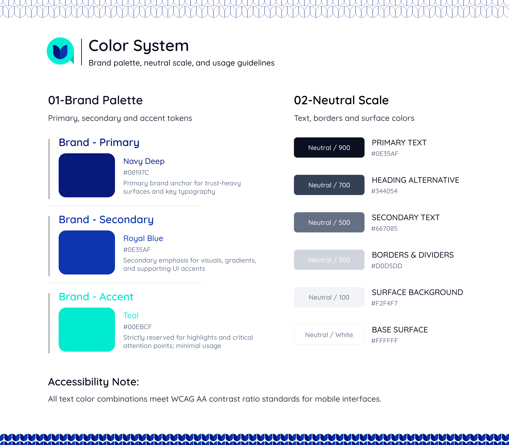
  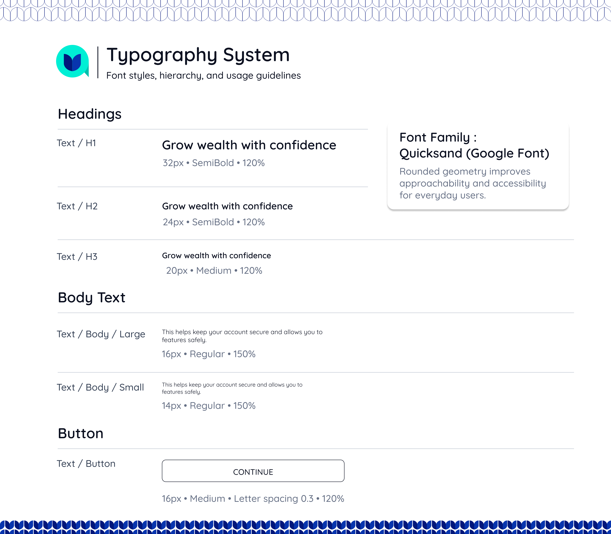
  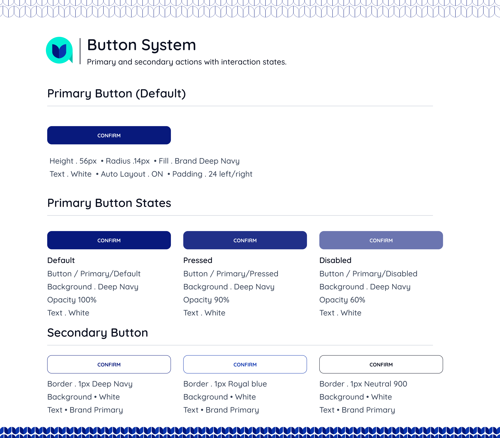
  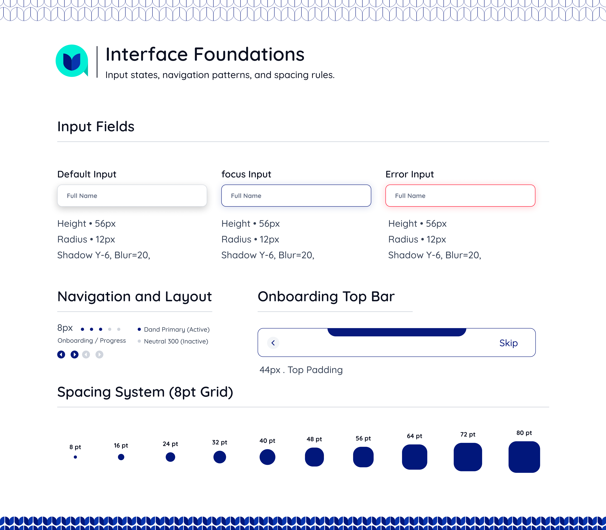
  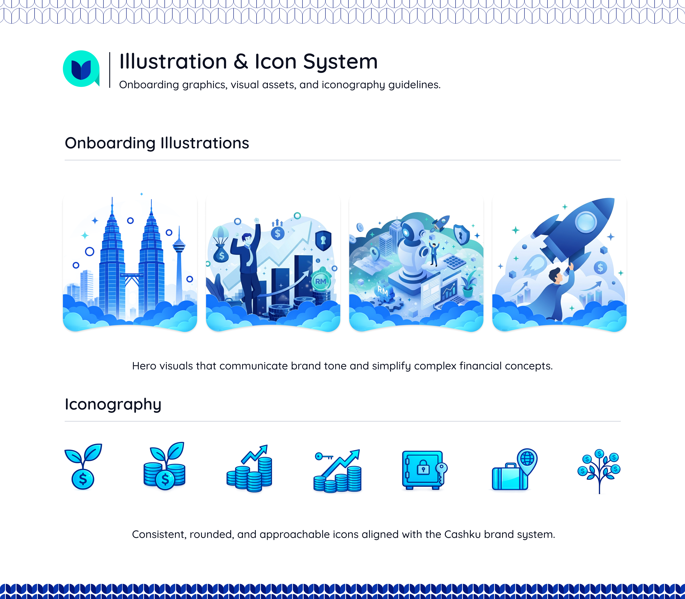
</p>

*Note: All Custom illustrations and icons utilized in the screens are included under the `assets/` directory.*

## 📸 Screenshots

<p align="center">
  
  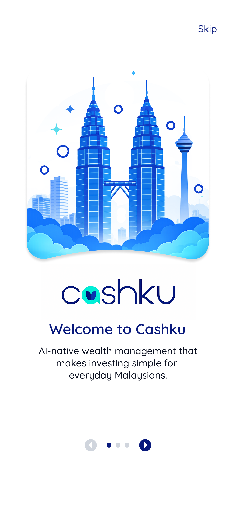
  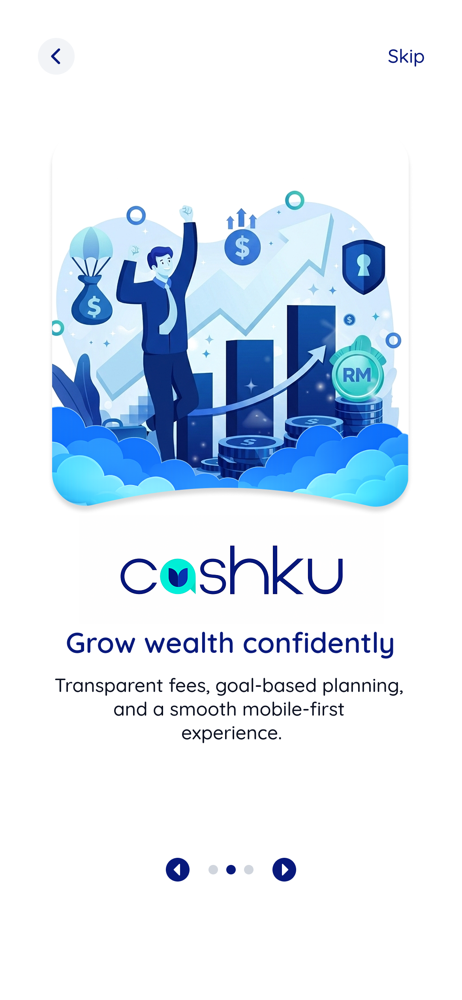
  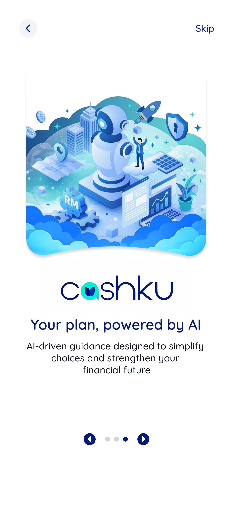
  
</p>
<p align="center">
  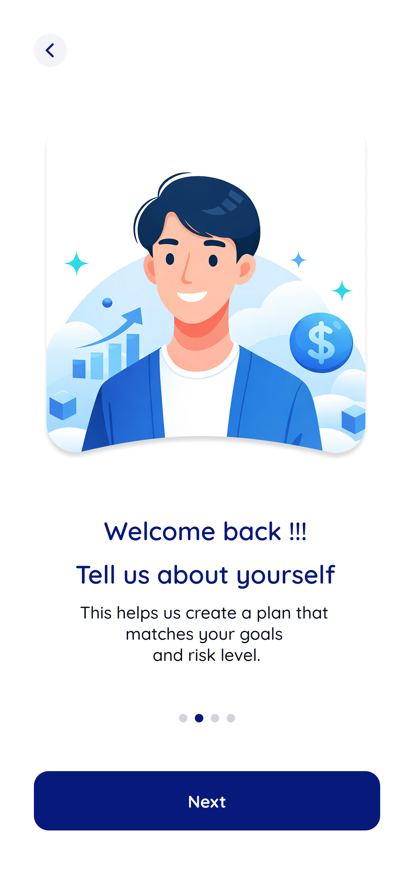
  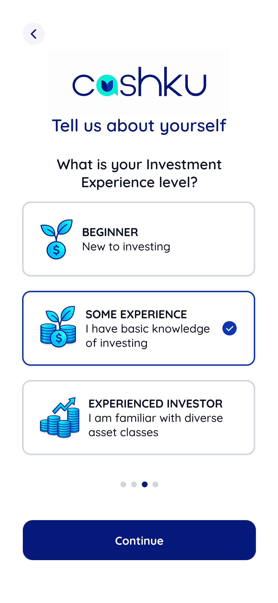
  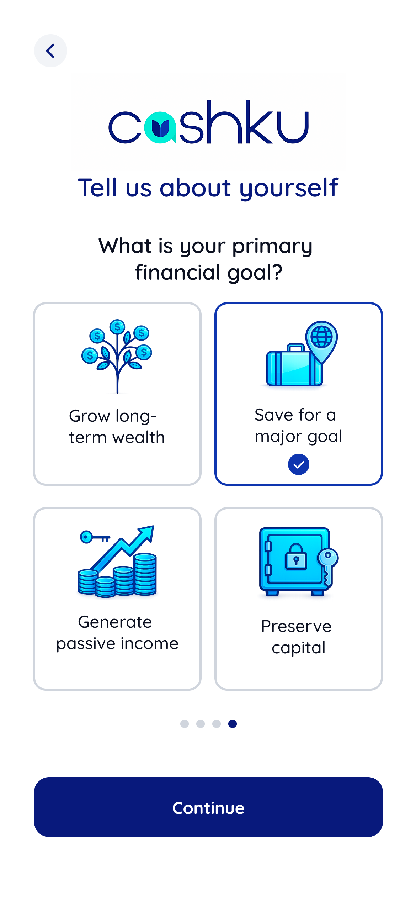
  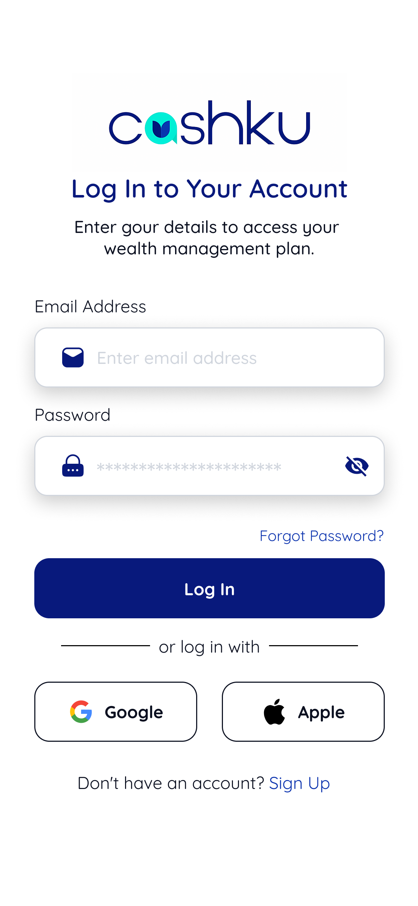
  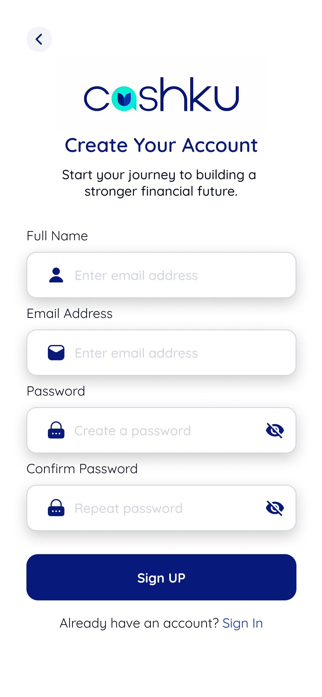
</p>

*(Note: Ensure all 10 images are placed in the `/screenshots` folder.)*

## 🗺 Screens Overview

The application follows this primary navigation flow:
1. `/splash` — Initial brand load
2. `/onboarding` — Value proposition carousels
3. `/profile/intro` — Warm welcome and transition into profiling
4. `/profile/experience` — Selection of investment experience level
5. `/profile/goals` — Selection of primary financial goals
6. `/auth/login` — Returning user authentication
7. `/auth/signup` — New user registration

*Note: This repository contains the UI and client-side logic only (no backend).*

## 🏁 Getting Started

### Requirements
- Flutter SDK `^3.7.2` or higher
- Dart SDK `^3.0.0` or higher
- Android Studio / Xcode for deployment

### Setup & Run Commands

1. **Get Dependencies:**
   ```bash
   flutter pub get
   ```

2. **Run the App (Default Flow):**
   ```bash
   flutter run
   ```

3. **Run the App (Showcase Mode):**
   To bypass the standard flow and jump straight to the UI showcase gallery (useful for development and UI component testing):
   ```bash
   flutter run --dart-define=SHOWCASE=true
   ```

### 📦 Building for Production

To generate a production-ready, universal APK without splitting per ABI:
```bash
flutter build apk --release --no-split-per-abi
```
*The resulting APK will be located at `build/app/outputs/flutter-apk/app-release.apk`.*

## 📁 Folder Structure (Brief)

```text
lib/
├── app/               # Root app configuration and go_router setup
├── core/              # Design tokens (colors, metrics, typography), constants
├── shared/            # Reusable widgets (buttons, text fields, cards)
└── features/          # Feature-based modular code
    ├── onboarding/    # Splash & Onboarding screens
    ├── profiling/     # User data collection screens
    ├── auth/          # Login & Signup screens
    └── showcase/      # Dev-only component gallery
```

## 🤝 Contribution

Contributions, issues, and feature requests are welcome!
Feel free to check [issues page](https://github.com/kareem2032/Cashku-Mobile-Onboarding/issues).

## 📄 License

This project is licensed under the MIT License - see the [LICENSE](LICENSE) file for details.
